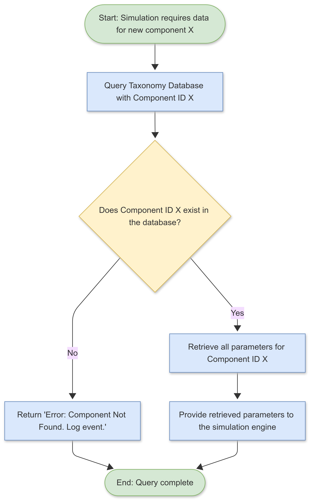

# DATA STRUCTURE & TAXONOMY FOR HYDROGEL-BASED ANALOGUE COMPONENTS

**Conceptual Systems Architecture | Author: Joshua Hasinski | Date: July 4, 2025**

> **Disclaimer:** The following document is a curated example from a three-year, self-directed conceptual design project. This project was developed through an iterative Q&A process with Google's AI assistant, Gemini, which served as a tool for brainstorming, analysis, and content generation. All final concepts, structures, and documentation were directed and approved by the author.

---

## 1.0 OBJECTIVE

This document outlines a sample from the hierarchical taxonomy and data structure designed to classify and manage the properties of hydrogel-based analogue components within the system. The objective of this taxonomy is to create a **controlled vocabulary** and a logical, scalable framework. This ensures data consistency, facilitates efficient querying of component properties, and provides a clear, unambiguous foundation for all procedural generation and simulation involving these materials.

---

## 2.0 METHODOLOGY & DESIGN PRINCIPLES

The taxonomy was designed using a top-down, hierarchical approach. The primary design principles were **clarity**, **scalability**, and **logical integrity**. Each component is assigned a unique classification code based on its position in the hierarchy, and its attributes are defined by a set of standardized parameters.

* **Clarity:** A controlled vocabulary is used for all parameters to eliminate ambiguity (e.g., "Tensile Strength" is always measured in megapascals (MPa)).
* **Scalability:** The hierarchical structure allows for the addition of new component classes, sub-classes, and parameters without requiring a redesign of the entire system.
* **Logical Integrity:** The structure ensures that a component cannot possess contradictory attributes. For example, a component classified as "Rigid" cannot have a high "Elasticity" value.

---

## 3.0 SAMPLE TAXONOMY & DATA STRUCTURE

The following is a representative sample of the taxonomy, focusing on the **"Structural"** class of components.

### 3.1 Top-Level Class: 1.0 - Hydrogel Component
* **Description:** The root class for all hydrogel-based materials used in the system.

### 3.2 Sub-Class: 1.1 - Structural Components
* **Description:** Components primarily designed for load-bearing and forming the physical chassis or skeleton of an entity.
* **Core Parameters:**
    * `Material_Density (g/cm³)`
    * `Tensile_Strength (MPa)`
    * `Energy_Cost_per_Unit (kJ/g)`
    * `Fatigue_Resistance_Cycle_Limit`

### 3.3 Type: 1.1.1 - Flexible Support
* **Description:** Structural components that allow for movement and flexion, akin to synthetic cartilage or muscle fascia.
* **Type-Specific Parameters:**
    * `Max_Elasticity_Modulus (%)`
    * `Torsion_Limit (degrees)`
* **Example Instance:** `1.1.1a - Vertebral Disc Analogue`

### 3.4 Type: 1.1.2 - Rigid Frame
* **Description:** Structural components that provide a rigid, non-flexible framework, akin to synthetic bone.
* **Type-Specific Parameters:**
    * `Compressive_Strength (MPa)`
    * `Fracture_Toughness (MPa√m)`
* **Example Instance:** `1.1.2a - Femur Analogue`

### 3.5 Data Structure (Conceptual Example for one instance)

* `Component_ID`: **HSC-112a-001**
* `Classification_Code`: **1.1.2a**
* `Common_Name`: **Femur Analogue**
* `Material_Density`: **1.85 g/cm³**
* `Tensile_Strength`: **130 MPa**
* `Energy_Cost_per_Unit`: **35 kJ/g**
* `Fatigue_Resistance_Cycle_Limit`: **1,500,000**
* `Compressive_Strength`: **170 MPa**
* `Fracture_Toughness`: **5.2 MPa√m**

---

## 4.0 CONCEPTUAL QUERY FLOWCHART

*Note: Replace `PATH_TO_YOUR_IMAGE.PNG` with the actual file path or URL for your flowchart image.*

---

## 5.0 CONCLUSION

This structured taxonomy is essential for the stability and scalability of the entire system. It provides a robust, queryable database of material properties that serves as the "source of truth" for the simulation engine. This organized approach to data management prevents logical inconsistencies in entity generation and ensures that all behaviors (such as stress response and repair) are based on a consistent, predictable set of physical laws.