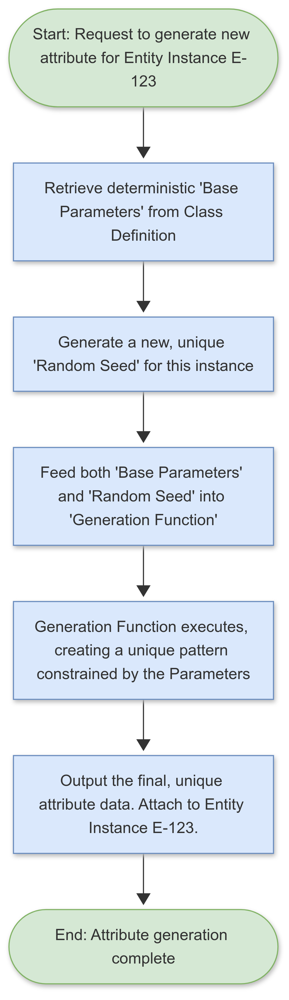

# FRAMEWORK FOR PROCEDURAL GENERATION OF UNIQUE ENTITY ATTRIBUTES

**Conceptual Systems Architecture | Author: Joshua Hasinski | Date: July 4, 2025**

> **Disclaimer:** The following document is a curated example from a three-year, self-directed conceptual design project. This project was developed through an iterative Q&A process with Google's AI assistant, Gemini, which served as a tool for brainstorming, analysis, and content generation. All final concepts, structures, and documentation were directed and approved by the author.

---

## 1.0 OBJECTIVE

This document outlines the conceptual framework for a **procedural generation** system capable of producing a vast number of unique, complex attributes for distinct entities. The primary objective is to ensure that while each entity belongs to a specific class with shared characteristics, every individual instance possesses unique, non-repeating patterns and properties. This allows for scalable and efficient world-building without sacrificing individuality, preventing the visual monotony common in large-scale simulations.

---

## 2.0 METHODOLOGY & DESIGN PRINCIPLES

The framework is built on a hybrid methodology that combines **deterministic inputs** with **randomized seeds** to guarantee both consistency and uniqueness.

* **Design Principle 1: Deterministic Inheritance**
    Each entity class is defined by a set of **"Base Parameters"** (a conceptual "genome"). These parameters dictate the core characteristics and constraints for that class, ensuring all entities within it are recognizably related.

* **Design Principle 2: Instance Uniqueness**
    For every specific attribute of every individual entity that is generated, the system creates a new, unique **"Random Seed"** (a large, unpredictable number).

* **Design Principle 3: Emergent Complexity**
    A **"Generation Function"** (a conceptual algorithm) takes both the deterministic Base Parameters and the unique Random Seed as its inputs. By processing these combined inputs, the function can produce highly complex and varied outputs that are consistent with the inherited traits but are unique in their specific expression.

> This methodology is comparable to building from a single architectural blueprint (the Base Parameters). While the blueprint is the same for every house, the specific plot of land, the unique wear on the tools, and the daily decisions of the construction crew (the Random Seed) ensure that no two resulting houses are ever truly identical.

---

## 3.0 FRAMEWORK ARCHITECTURE

The procedural generation pipeline consists of three distinct stages: Input, Processing, and Output.

### 3.1 Input Stage
This stage gathers the necessary data for generation.
* **Inherited Trait Input:** The system retrieves the relevant **Base Parameters** from the entity's class definition (e.g., color palette constraints, maximum size, structural rules).
* **Uniqueness Input:** The system's random number generator produces a new, unique, and unpredictable **Seed** value for this specific generation event.

### 3.2 Processing Stage
* **Generation Function:** This conceptual algorithm (e.g., a Perlin noise function, a Lindenmayer system, or other rule-based pattern generator) accepts both the Inherited Traits and the Uniqueness Seed. It uses the Seed to initialize its random state and the Inherited Traits to constrain its output, ensuring the generated pattern is unique and appropriate for the class.

### 3.3 Output Stage
* **Unique Attribute:** The Generation Function outputs the final data for the unique attribute (e.g., the specific color pattern on a surface, the precise topology of a component, the branching structure of a limb). This attribute is then attached to the specific entity instance.

---

## 4.0 CONCEPTUAL FLOWCHART LOGIC

---

## 5.0 CONCLUSION

This procedural generation framework provides a robust and highly scalable method for creating near-infinite variation within a structured and coherent system. It is a cornerstone of the project's design, enabling the creation of a rich and diverse population of entities while maintaining computational efficiency. This approach showcases an understanding of how to balance order and chaos to produce **emergent complexity**, a key requirement for creating believable and engaging large-scale simulations.