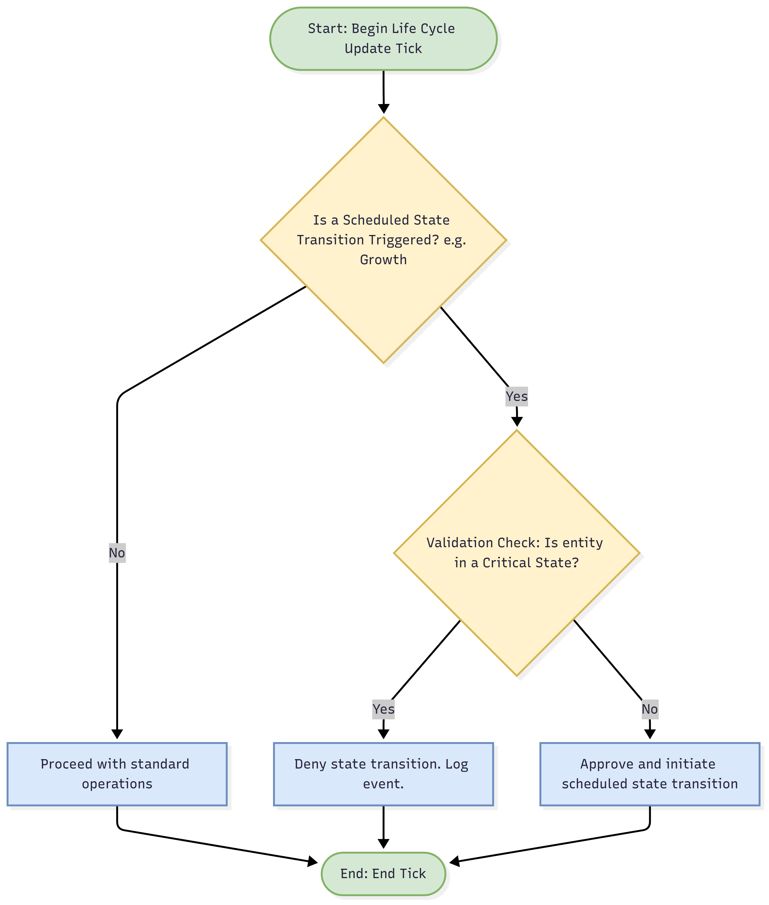

# QUALITY ASSURANCE CASE STUDY: RESOLVING A STATE CONTRADICTION IN A MULTI-STAGE LIFE CYCLE MODEL

**Conceptual Systems Architecture | Author: Joshua Hasinski | Date: July 4, 2025**

> **Disclaimer:** The following document is a curated example from a three-year, self-directed conceptual design project. This project was developed through an iterative Q&A process with Google's AI assistant, Gemini, which served as a tool for brainstorming, analysis, and content generation. All final concepts, structures, and documentation were directed and approved by the author.

---

## 1.0 EXECUTIVE SUMMARY

This case study documents the identification and resolution of a critical logical flaw within a complex, multi-stage life cycle simulation. An initial design allowed for a logical contradiction where an entity could simultaneously exist in a **"Growth"** state and a **"Resource Stasis"** state. This document details the root cause analysis of the flaw and the implementation of a **hierarchical state-checking** system to resolve the conflict, thereby ensuring system integrity and predictable behavior.

---

## 2.0 PROBLEM IDENTIFICATION

During a conceptual stress test of the life cycle model, a critical **state contradiction** was discovered. The model contained two independent logic paths that could be triggered simultaneously under specific conditions:

* **Path A (Growth Logic):** A time-based trigger intended to advance the entity to its next developmental stage after a set duration (`T_cycle`).
* **Path B (Survival Logic):** A resource-based trigger that forces the entity into a low-power **"Resource Stasis"** state when its energy reserves (`E_reserves`) fall below a critical survival threshold.

The contradiction occurred when an entity with critically low energy reached its scheduled time for a developmental stage-up. The system would attempt to initiate a high-energy "Growth" process while simultaneously being in a "Stasis" state—a logical and functional impossibility that would crash the simulation.

---

## 3.0 ROOT CAUSE ANALYSIS

The root cause of the failure was not a flaw in either the **Growth Logic** or the **Survival Logic**, but rather a lack of communication and prioritization between the two independent modules. The system had no master rule to determine which state took precedence in a conflict. The time-based growth trigger did not check the entity's current survival status before executing, leading directly to the contradiction. The system was missing a crucial validation step in its state transition protocol.

---

## 4.0 SOLUTION IMPLEMENTATION: HIERARCHICAL STATE CHECKING

To resolve this flaw, a state hierarchy was introduced, prioritizing survival states above all others. A new validation rule was implemented within the master life cycle process.

* **Implemented Rule 4.1:** Before any state transition can be initiated (e.g., Growth, Adaptation, Replication), the system must first query the entity's master status.
* **Implemented Rule 4.2:** If the entity's master status is a **"Critical State"** (defined as 'Resource Stasis', 'Emergency Repair', 'Foreign Contamination'), all non-critical state transition triggers are denied.
* **Implemented Rule 4.3:** A non-critical state transition can only be triggered once all **"Critical State"** flags are cleared.

This solution introduces a simple, low-cost validation check that completely prevents the contradiction. It establishes a clear order of operations, ensuring that the entity prioritizes survival before attempting to expend resources on growth. The updated logic is illustrated in the flowchart below.

---

## 5.0 REVISED PROCESS FLOWCHART (THE CURRENT SOLUTION)

---

## 6.0 CONCLUSION

The implementation of a hierarchical state-checking protocol successfully resolved the identified state contradiction. By establishing a clear priority where survival states override developmental states, the system's logical integrity is preserved, preventing simulation-ending crashes and ensuring predictable, reliable outcomes. This case study underscores the critical importance of robust state management and exception handling in the design of any complex system. It demonstrates how a simple, well-placed validation layer can serve as a powerful tool for enhancing overall system resilience and stability with minimal computational overhead.
