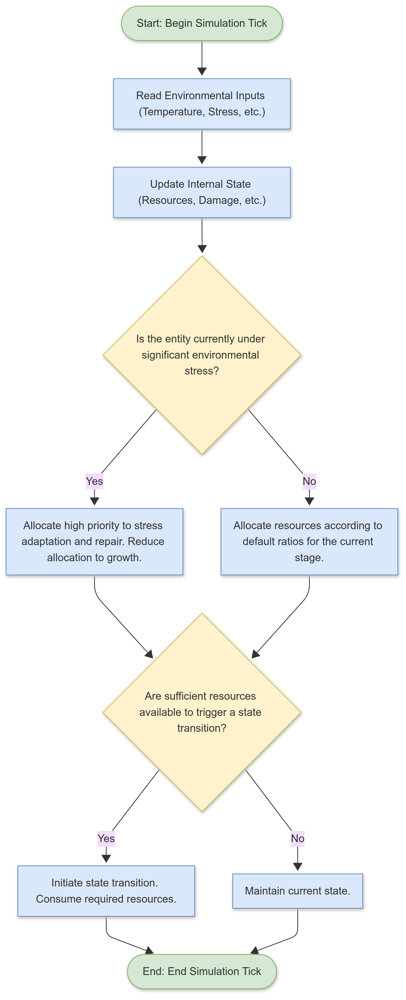

# SIMULATION MODEL FOR MULTI-STAGE LIFE CYCLE AND ENVIRONMENTAL ADAPTATION

**Conceptual Systems Architecture | Author: Joshua Hasinski | Date: July 4, 2025**

> **Disclaimer:** The following document is a curated example from a three-year, self-directed conceptual design project. This project was developed through an iterative Q&A process with Google's AI assistant, Gemini, which served as a tool for brainstorming, analysis, and content generation. All final concepts, structures, and documentation were directed and approved by the author.

---

## 1.0 OBJECTIVE

This document outlines the conceptual framework for a simulation model designed to capture the complex, multi-stage life cycle of an entity subject to both internal resource constraints and external environmental stresses. The primary objective is to create a dynamic system that accurately models the interplay between growth, maintenance, adaptation, and eventual degradation, allowing for the observation of emergent behaviors and long-term system stability.

---

## 2.0 METHODOLOGY & DESIGN PRINCIPLES

The simulation model is built around the concept of a **state machine**, where the entity transitions between distinct developmental stages based on a combination of internal logic and external stimuli.

* **Design Principle 1: Multi-Stage Development**
    The entity progresses through a series of predefined stages (e.g., "Initial State," "Growth Phase," "Mature State," "Decline Phase"). The transitions between these stages are triggered by internal events (e.g., reaching a certain size, accumulating a certain amount of internal energy) or external events (e.g., exposure to a specific environmental stressor).

* **Design Principle 2: Resource Allocation**
    The entity has a finite pool of internal resources (represented as a numerical value) that must be allocated between competing needs: growth, maintenance/repair of damaged components, and adaptation to new environmental loads. The model incorporates rules that prioritize resource allocation based on the entity's current state and the severity of the stressor.

* **Design Principle 3: Stress Adaptation**
    The entity can modify its structure or behavior in response to environmental stresses (e.g., changes in temperature, gravitational load, radiation levels). These adaptations consume resources and may have trade-offs (e.g., increasing resistance to one stressor may decrease resistance to another).

* **Design Principle 4: Material Fatigue and Degradation**
    The model accounts for the fact that all components have a finite lifespan and are subject to fatigue. Over time, components accumulate damage, reducing their efficiency and increasing their energy consumption for maintenance.

---

## 3.0 SIMULATION ARCHITECTURE

The simulation proceeds in discrete time steps (or "ticks"). At each tick, the following processes occur in sequence:

### 3.1 Environmental Input
The simulation engine reads the current environmental conditions (temperature, stress levels, resource availability).

### 3.2 Internal State Update
The entity's internal parameters are updated (resource levels, component damage levels, current developmental stage).

### 3.3 Resource Allocation
The entity allocates its available resources according to its current state and any detected stresses. This may involve prioritizing maintenance of critical components, initiating adaptation processes, or investing in growth.

### 3.4 State Transition Logic
The system checks if any conditions are met to trigger a transition to a new developmental stage.

### 3.5 Output
The simulation engine records the entity's state and behavior for this tick.

---

## 4.0 CONCEPTUAL FLOWCHART LOGIC

---

## 5.0 CONCLUSION

This simulation model provides a powerful framework for understanding the complex interplay between an entity and its environment. By modeling resource constraints, stress adaptation, and life cycle stages, the system allows for the observation of emergent behaviors such as resilience, fragility, and long-term survival strategies. This demonstrates a high-level understanding of dynamic systems and the ability to translate abstract concepts into a concrete, operational model.