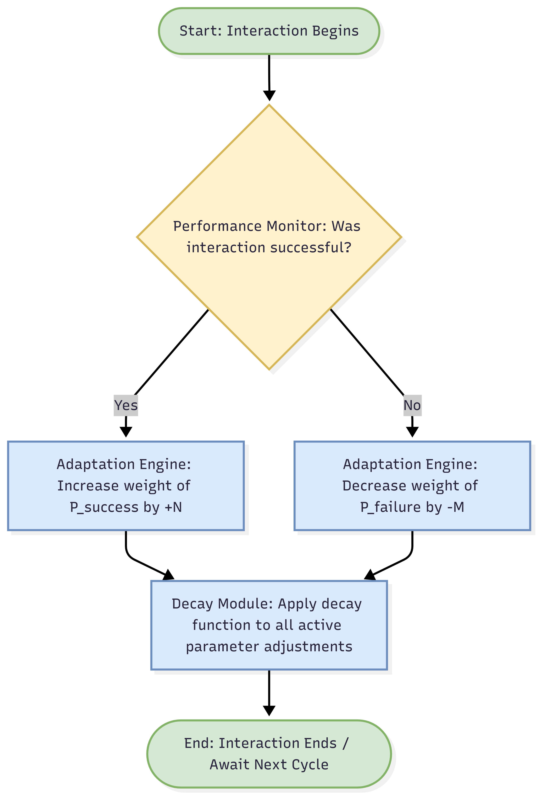

# SYSTEM SPECIFICATION: AN ADAPTIVE BEHAVIOR PROTOCOL FOR DYNAMIC SYSTEMS

**Conceptual Systems Architecture | Author: Joshua Hasinski | Date: July 4, 2025**

> **Disclaimer:** The following document is a curated example from a three-year, self-directed conceptual design project. This project was developed through an iterative Q&A process with Google's AI assistant, Gemini, which served as a tool for brainstorming, analysis, and content generation. All final concepts, structures, and documentation were directed and approved by the author.

---

## 1.0 EXECUTIVE SUMMARY

This document specifies the architecture for an **Adaptive Behavior Protocol (ABP)**. The ABP is a rule-based framework designed to enable a system or agent to dynamically modify its behavior over time based on its interaction history and performance feedback. The objective is to optimize for desired outcomes (e.g., efficiency, stability, goal achievement) while avoiding repetitive, negative patterns. The system is designed around a core feedback loop coupled with a parameter decay mechanism to ensure both adaptability and resilience.

---

## 2.0 PROBLEM STATEMENT & DESIGN RATIONALE

### 2.1 Problem Statement
In complex systems, static, non-adaptive behaviors can lead to predictable failures and an inability to cope with changing environments. A system that cannot learn from its history is brittle and inefficient. The primary problem is how to enable a system to learn from both positive and negative feedback without becoming permanently locked into a suboptimal strategy based on a limited set of early interactions.

### 2.2 Design Rationale
Several solutions were considered to address the problem of behavioral rigidity. A system with permanent adaptations was rejected due to the risk of *ossification*. A system with a manual "hard reset" was rejected as it would be inefficient and lose all accumulated learning.

Applying the principle of parsimony (Occam's Razor, or "minimal logical assumption"), the most elegant solution is a system that incorporates gradual adaptation with a natural decay. This approach provides the most functionality with the least complexity. It allows the system to react to immediate feedback while ensuring that no single adaptation can permanently dominate its logic. This **"fading memory"** approach was selected as the core of the ABP.

---

## 3.0 SYSTEM ARCHITECTURE & METHODOLOGY

The ABP is composed of three core components: the **Performance Monitor**, the **Adaptation Engine**, and the **Decay Module**.

### 3.1 Performance Monitor
This component actively tracks interactions and classifies them as **"Successful"** or **"Unsuccessful"** based on predefined criteria (e.g., reaching a goal, avoiding a hazard).

### 3.2 Adaptation Engine
This is the core rule-based logic. It modifies key behavioral parameters in response to feedback from the Performance Monitor.

* **Rule 3.2.1:** Upon a **"Successful"** interaction, increase the weight of the associated behavioral parameter (`P_success`) by a value of `+N`.
* **Rule 3.2.2:** Upon an **"Unsuccessful"** interaction, decrease the weight of the associated behavioral parameter (`P_failure`) by a value of `-M`.

### 3.3 Decay Module
This component ensures the system remains adaptable.

* **Rule 3.3.1:** After a set number of cycles or a specific duration (`T`), the absolute value of all adjustments made by the Adaptation Engine is reduced by a fixed percentage (`D%`). This prevents any single parameter from growing infinitely and allows the system to "unlearn" strategies that are no longer effective.

---

## 4.0 PROCESS FLOWCHART

---

## 5.0 CONCLUSION & POTENTIAL APPLICATIONS

The **Adaptive Behavior Protocol** provides a robust and elegant framework for creating dynamic, learning systems. By combining immediate feedback with a gradual decay of influence, the ABP ensures that a system can remain both responsive to its immediate history and resilient to long-term strategic stagnation.

This conceptual model has wide-ranging applications, including but not limited to:

* AI behavior in simulations or games.
* Optimization algorithms for resource allocation.
* Dynamic adjustment of user interface elements based on user habits.
* Robotic control systems navigating unpredictable terrain.